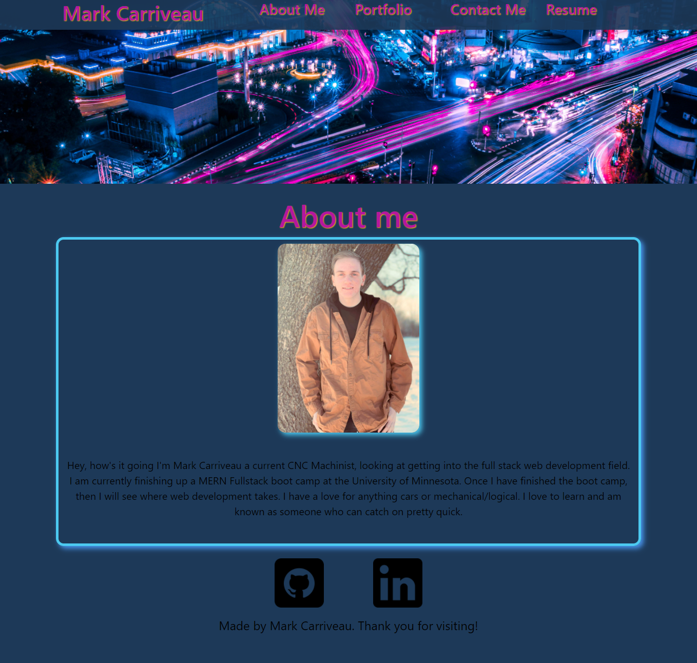

# React Portfolio

## Description
This is my personal portfolio page. On this page you will find a section about
me and who I am. A portfolio with 5 projects that I'm the most proud of. A
section that you can contact me there is no backend set up for it yet so if you
would like to get into contact with me please see the section in the readme
labled <strong>questions</strong>. and then that last page is my resume.

## Code description
This was build using react and bootstrap. There was a one custom helpers
function to check for email validation and the coloring and design of the page
was all made by me. React was used to have state and components on the page and
to make my life a lot easier then build a bunch of html files.

## Link
[Portfolio](https://mjbc53.github.io/portfolio/)
[GitHub Repo](https://github.com/mjbc53/portfolio)

## Page Screenshots

## Questions
If you have any further questions please contact me by email or with my GitHub Username listed below

* Email : mjbc53@gmail.com

* GitHub [mjbc53](https://github.com/mjbc53) 